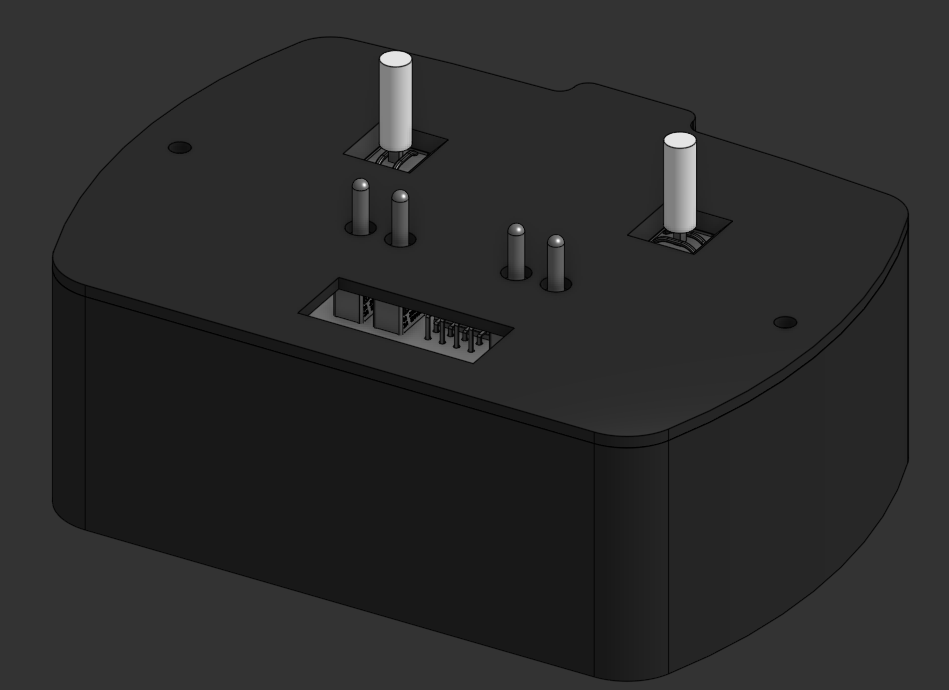
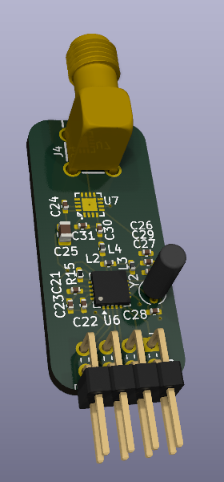
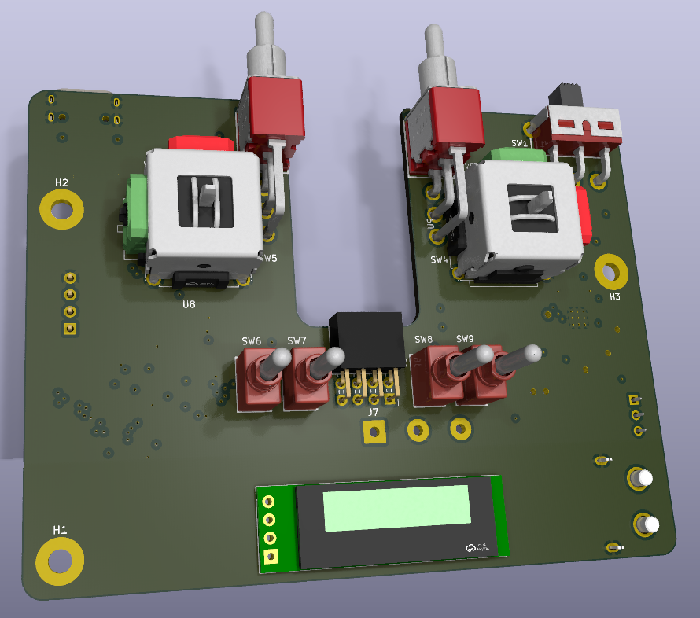

# RC Transmitter

This is an RC Transmitter for controlling things like planes or cars. It's made with a rp2040 microcontroller and a nRf24 ic for the wireless comunication.

## CAD
The transmitter is fully 3D printed and uses about 80g of filament. The parts required for assembly are in the BOM. To assemble it you place M3 nuts and add a screw through them. It was fully designed in onshape, so [you can view it](https://cad.onshape.com/documents/07641ffae3f4ad45f3c4466a/w/8f5604270294a6fafcbc2443/e/dfa80ad51705840b5752194c?renderMode=0&uiState=69ac4f1de3e454b85e083a43).

## PCB
In the transmitter are 2 PCBs. One is a 2 layer board for all the wireless things. The same board can be used to recieve the signals, so you need at least 2 of these.

The other one is 4 layers and has everything else on it: the input, microcontroller, battery management. 

More info on the 2 boards can be found here.

## Firmware
The firmware is setup to transmit everythingvia the second core of the rp2040. This makes sure that it's always available to transmit. The main core does everything else, like drawing to the screen and comunicating with the other ICs. Because this happends on a seperate core, a long I²C message won't stop the transmission. Flashing the board canbe done by shorting the two program pads while booting the board, and flashing the uf2 file via the USb connection.

## BOM
This is the simplified BOM. You can find the full and other BOMs here.

|Category  |Item           |Quantity|Unit Price|Total Price|Running Total|
|----------|---------------|--------|----------|-----------|-------------|
|Components|LCSC Components|1       |$43.52    |$43.52     |$43.52       |
|Components|LCSC Shipping  |1       |$11.44    |$11.44     |$54.96       |
|PCB       |RF PCB         |1       |$2.10     |$2.10      |$57.06       |
|PCB       |Main PCB       |1       |$7.00     |$7.00      |$64.06       |
|PCB       |Stencil        |1       |$12.00    |$12.00     |$76.06       |
|PCB       |JLCPCB Shipping|1       |$20.15    |$20.15     |$96.21       |